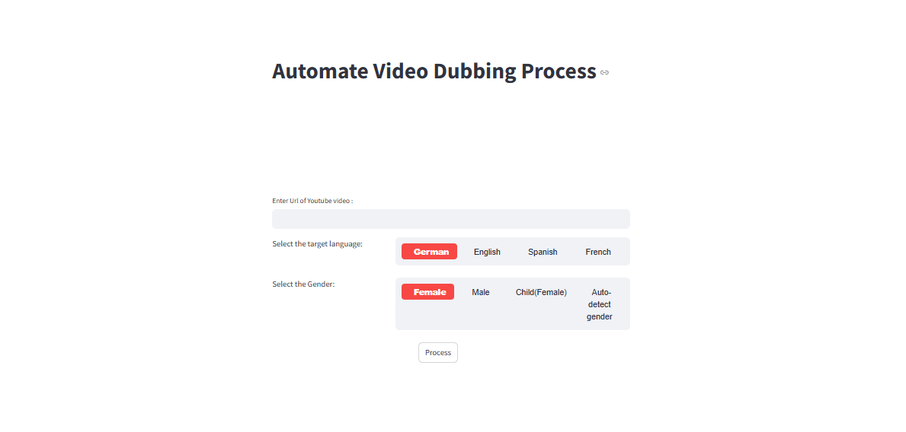

# 🎙️ PolyDub: AI-Powered Multilingual Video Dubbing App

PolyDub is an AI-powered application that takes a YouTube URL as input and produces a dubbed version of the video in a selected target language and voice gender. It streamlines video localization using cutting-edge speech recognition, translation, and voice synthesis technologies.



## 🚀 Features

- 🎞️ Download YouTube videos using **PyTube**
- 🧠 Transcribe speech using **OpenAI Whisper**
- 🌐 Translate text into multiple languages with **Translator**
- 🗣️ Generate natural, gender-specific voiceovers using **TTS models**
- 🎬 Sync dubbed audio with video via **MoviePy**
- 🔊 Supports **single-speaker** videos (multi-speaker support in roadmap)

## 🛠️ Tech Stack

- **Python**
- **PyTube** – Video downloading
- **Pydub** – Audio processing
- **OpenAI Whisper** – Speech-to-text transcription
- **Google Translate / DeepL / other Translator** – Language translation
- **TTS Models** – Text-to-speech synthesis (e.g., Bark, Coqui, ElevenLabs, etc.)
- **MoviePy** – Audio-video editing and synchronization

## 📦 Installation

1. Clone the repository:
   ```bash
   git clone https://github.com/Vishnu-add/PolyDub.git
   cd PolyDub
    ````

2. Create and activate a virtual environment:

   ```bash
   python -m venv venv
   source venv/bin/activate  # On Windows: venv\Scripts\activate
   ```

3. Install dependencies:

   ```bash
   pip install -r requirements.txt
   ```

## 📄 Usage

1. Run the main script:

   ```bash
   python app.py `url` `target_lang` `target_gender`
   ```

2. The app will process the video and generate a dubbed version in the output folder.


## 📌 Limitations

* Designed for **single-speaker** videos.
* Performance may vary depending on video quality and background noise.
* Multi-speaker handling and speaker diarization coming soon.

## 🙌 Contributing

Contributions, feature requests, and issues are welcome! Feel free to open a PR or issue.


